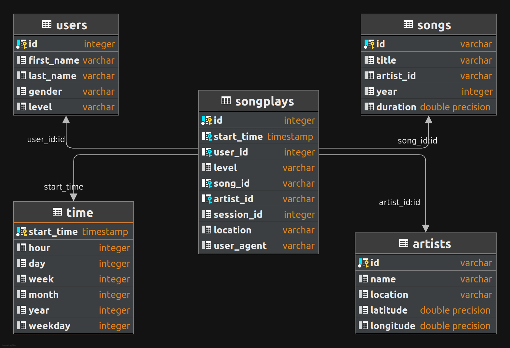

# Project purpose

This database goal is to provide data for the analytics team on Sparkify, a startup that has a music streaming app. Their data is stored in JSON files and the analysts need to use SQL queries to study their users preferences and behaviours. The proposed solution is a PostgreSQL database using a star schema in order to represent the sonplay facts and their dimensions.


# Database schema

This database is designed based on a star schema, where the songplay facts reffer to the song, artist, user and time dimensions.




# ETL
## Data source

### Song Dataset

The first dataset is a subset of real data from the Million Song Dataset. Each file is in JSON format and contains metadata about a song and the artist of that song. The files are partitioned by the first three letters of each song's track ID. For example, here are filepaths to two files in this dataset.

---
song_data/A/B/C/TRABCEI128F424C983.json
<br />
song_data/A/A/B/TRAABJL12903CDCF1A.json
---

```
{
   "num_songs":1,
   "artist_id":"ARJIE2Y1187B994AB7",
   "artist_latitude":null,
   "artist_longitude":null,
   "artist_location":"",
   "artist_name":"Line Renaud",
   "song_id":"SOUPIRU12A6D4FA1E1",
   "title":"Der Kleine Dompfaff",
   "duration":152.92036,
   "year":0
}
```


### Log Dataset

The second dataset consists of log files in JSON format generated by this event simulator based on the songs in the dataset above. These simulate activity logs from a music streaming app based on specified configurations.

The log files in the dataset are partitioned by year and month.

For example, here is a register in the log file.

```
{
   "artist":"Des'ree",
   "auth":"Logged In",
   "firstName":"Kaylee",
   "gender":"F",
   "itemInSession":1,
   "lastName":"Summers",
   "length":246.30812,
   "level":"free",
   "location":"Phoenix-Mesa-Scottsdale, AZ",
   "method":"PUT",
   "page":"NextSong",
   "registration":1540344794796.0,
   "sessionId":139,
   "song":"You Gotta Be",
   "status":200,
   "ts":1541106106796,
   "userAgent":"\"Mozilla\/5.0 (Windows NT 6.1; WOW64) AppleWebKit\/537.36 (KHTML, like Gecko) Chrome\/35.0.1916.153 Safari\/537.36\"",
   "userId":"8"
}
```
## ETL pipeline

The data goes through a pipeline which consists in the following steps:
1. Load JSON files in the directory
2. Convert data into a pandas dataframe
3. Insert rows using SQL insert statements using a psycopg2 cursor connected to the database

### Conflicts

In case of conflicts when adding new rows to the dimension tables, the sql query is set not to insert a duplicate row. 

When there is a conflict adding a new row to the users table, it is updated using the more recent data about them.

# Example queries for song analysis

Some queries that can be ran in order to extract certain metrics from the database

## Number of active users by month

``` sql
SELECT t.year,
       t.month,
       COUNT(DISTINCT user_id) AS active_users
FROM songplays AS s
  LEFT JOIN time AS t ON s.start_time = t.start_time
GROUP BY 1,2
```

## Top artist by month 

``` sql
WITH play_count AS (
  SELECT t.year,
         t.month,
         a.name AS artist_name,
         COUNT(*) AS plays
  FROM songplays AS s
    LEFT JOIN artists AS a ON s.artist_id = a.id
    LEFT JOIN time AS t ON s.start_time = t.start_time
  GROUP BY 1,2,3
)
SELECT year,
       month,
       artist_name,
       plays,
       RANK() OVER (PARTITION BY year, month ORDER BY plays DESC)
FROM play_count
```

## Share by membership level

``` sql
WITH plays_users_month AS (
  SELECT t.year,
         t.month,
         COUNT(DISTINCT s.user_id) AS active_users,
         COUNT(*) AS plays
  FROM songplays AS s
    LEFT JOIN time AS t ON s.start_time = t.start_time
  GROUP BY 1,2
),
play_users_level_month AS (
  SELECT t.year,
         t.month,
         s.level,
         COUNT(DISTINCT s.user_id) AS active_users,
         COUNT(*) AS plays
  FROM songplays AS s
    LEFT JOIN time AS t ON s.start_time = t.start_time
  GROUP BY 1,2,3
)
SELECT DISTINCT
       l.year,
       l.month,
       l.level,
       l.active_users::FLOAT/m.active_users AS active_users_share,
       l.plays::FLOAT/m.plays AS plays_share
FROM play_users_level_month AS l
  LEFT JOIN plays_users_month AS m ON l.year = m.year
                                  AND l.month = m.month
```

# Project files
Some of the main files are:

- `create_tables.py`: recreates the database
- `etl.py`: extract the data from the JSON file, transform it into tables and load it to the database
- `sql_queries.py`: contains the SQL queries used to create the tables, insert and update their rows
